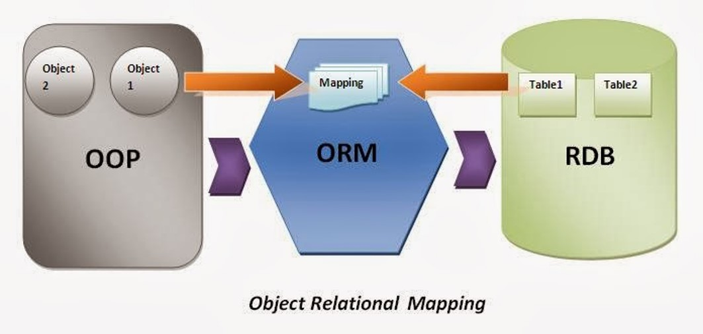

# Intro to EF Core with SQLite, Dependency Injection, and API testing


Rasmus Lystrøm
Associate Professor
ITU

---

## Feedback


All groups are working on their projects!

---

## Feedback

<iframe src="http://209.38.208.62/report_razor_apps.html" width="100%" height=600 scrolling="auto"></iframe>

---

## Feedback

- Have **one** main branch called `main`.
- Remember, we do trunk-based development in this course. That is, you do not have a long-lived `dev` branch (as in last semester's project). That would be another branching strategy.
- You have short-lived feature branches. That is, at latest after a day your changes land on the main branch and thereby automatically in production (your deployment workflows deploy all changes from main, right?)

What do we do if we cannot finish our feature during a day?

- Good observation, that means likely that your task descriptions in your issues are too coarse grained. Over time you should train to make them smaller so that you can complete your tasks in max. a day.

---

## Feedback

- Have **one** main branch called `main`.
- It is not advisable to have a `main2.0` branch.
- Likely, it is also not a good idea to call a branch `origin` since it is confusing when pointing to remote repositories in git commands.

---

## Process: Scientific problem solving

> 1. Identify the problem
> 2. Gather information
> 3. Iterate potential solutions
> 4. Test your solution<font size=3>
Source: <a href="https://www.oreilly.com/content/4-steps-to-solving-any-software-problem/">E. Cain <i>4 steps to solving any software problem</i></a>
</font>

---

# Code Review of last week's project

Use last week's project as motivation for ORM with EFCore
Domain modeling

Different terminology in domain model and in database schema, e.g., `user` vs `author` and `message` vs. `cheep`

# [Entity Framework Core](https://learn.microsoft.com/en-us/ef/core/)

Entity Framework (EF) Core is a lightweight, extensible, [open source](https://github.com/dotnet/efcore) and cross-platform version of the popular Entity Framework data access technology.

EF Core can serve as an object-relational mapper (O/RM), which:

- Enables .NET developers to work with a database using .NET objects.
- Eliminates the need for most of the data-access code that typically needs to be written.

EF Core supports many database engines, see [Database Providers](https://learn.microsoft.com/en-us/ef/core/providers/) for details.

# Why?

* What's wrong with writing SQL like we did last week?

* Object–relational impedance mismatch??

* Me not understand object me table

# Object Relational Mapping

The act of converting incompatible types in OOP to tables/columns/rows/relations in SQL

# What is an Object-relational-mapper (ORM)?



# Model


# What is a domain model?

[Wikipedia](https://en.wikipedia.org/wiki/Domain_model):

> In software engineering, a domain model is a conceptual model of the domain that incorporates both behavior and data


# Demo

## Entity Framework Core with Sqlite in a Console App

# Task: _EF Core with Sqlite_ 1

<!--
_backgroundImage: "linear-gradient(to bottom, #67b8e3, #0288d1)"
_color: white
_header: 15 minutes
-->

Complete this tutorial up to and including **Create the database**:

<https://learn.microsoft.com/en-us/ef/core/get-started/overview/first-app>

Inspect the database using a SQLite tool.

# Lambda Expressions


# Lambda Expressions

```csharp
Action<string> write = s => Console.WriteLine(s);

Func<int, int> square = a => a * a;
```

```csharp
Predicate<City> b = c => c.Name.StartsWith("B");

Converter<double, double> ftoC = c => c * 9.0 / 5.0 + 32.0;

...
```

# Demo

## Basic CRUD with EF Core

#


<https://twitter.com/overflow_meme/status/1223835574848630784>

# IDisposable


# <strike>IDisposable</strike>

```csharp
public class MyDisposableThingy : IDisposable
```

```csharp
var connection = new SqlConnection("...");
try
{
    ...
}
finally
{
    if (connection != null)
    {
        connection.Dispose();
    }
}
```

# <strike>IDisposable</strike>

```csharp
using (var connection = new SqlConnection("..."))
{
    ...
}
```

# <strike>IDisposable</strike>

```csharp
using var connection = new SqlConnection("...");
```

# Demo

## Dispose context


# Task: _EF Core with Sqlite_ 2

<!--
_backgroundImage: "linear-gradient(to bottom, #67b8e3, #0288d1)"
_color: white
_header: 10 minutes
-->

Complete remaining:

<https://learn.microsoft.com/en-us/ef/core/get-started/overview/first-app>

Ensure your context is disposed.

Inspect the database using a SQLite tool.

# Intro to LINQ

# Prerequisites


# Anonymous types

```csharp
var question = new
{
    Title = "The answer...?",
    Answer = 42
};
```

# (Tuples)

```csharp
var s = Tuple.Create("Clark Kent", "Superman");

var b = ("Bruce Wayne", "Batman");

var f = (name: "Barry Allen", alterEgo: "The Flash");

var random = new Random();

IEnumerable<(float x, float y)> GenerateCoordinates()
{
    yield return (random.NextSingle() * 100, random.NextSingle() * 100);
}
```

# Records

```csharp
public record Superhero(string Name, string AlterEgo, DateTime FirstAppearance);
```

# Data: Collection Initializer

```csharp
IEnumerable<City> cities = new[]
{
    new City(1, "Berlin"),
    new City(2, "Hamburg"),
    new City(3, "Frankfurt")
};

# Data: Collection + Object Initializer

```csharp
IEnumerable<City> cities = new[]
{
    new City { Id = 1, Name = "Berlin" },
    new City { Id = 2, Name = "Hamburg" },
    new City { Id = 3, Name = "Frankfurt" }
};
```

# Extension Methods


# Built-in Extension methods

```csharp
var count = cities.Count();

var sort = cities.OrderBy(c => c.Name);

var filter = cities.Where(c => c.Name.Contains("i"));

var pick = cities.FirstOrDefault(c => c.Id == 2);

var all = cities.All(c => c.Name.Length < 10);

var any = cities.Any(c => c.Name.StartsWith("B"));

var project = cities.Select(c => c.Name);
```

# Create your own extension method

```csharp
public static class Extensions
{
    public static int WordCount(this string str) =>
        str.Split(new[] { ' ', '.', '?' },
                  StringSplitOptions.RemoveEmptyEntries)
           .Length;
}
```

# Demo

## Extension Methods

# Task: Extension Methods

<!--
_backgroundImage: "linear-gradient(to bottom, #67b8e3, #0288d1)"
_color: white
_header: 10 minutes
-->

- Take the example from the previous task.
- Extend code to add 3-5 new blog posts.
- Experiment with the extension methods:

    - `Select`
    - `FirstOrDefault` / `First`
    - `Any`
    - `Count`
    - `Where`
    - ...

# LINQ - Language INtegrated Query


# LINQ

```csharp
var sorted = from c in cities
             where c.Name.Contains("i")
             orderby c.Name descending
             select new { Name = c.Name };
```

## Extension Methods Version

```csharp
var sorted = cities.Where(c => c.Name.Contains("i"))
                   .OrderByDescending(c => c.Name)
                   .Select(c => new { Name = c.Name });
```

# LINQ

## Demo

# Refactoring EF Core Context/Model

## Demo

# Design: Repository Pattern

<!--
_backgroundImage: "linear-gradient(to bottom, #deb887, #d17e12)"
_color: white
-->

> A system with a complex domain model often benefits from a layer, [...] that isolates domain objects from details of the database access code. In such systems it can be worthwhile to build another layer of abstraction over the mapping layer where query construction code is concentrated.
>
> A Repository mediates between the domain and data mapping layers, acting like an in-memory domain object collection. Client objects construct query specifications declaratively and submit them to Repository for satisfaction.
> Source and image source: <a href="https://www.martinfowler.com/eaaCatalog/repository.html">E. Hieatt et al.<i>Repository</i></a>


# Demo

## Repository Pattern

what do

---

## What to do now?


- If not done, complete the Tasks (blue slides) from this class
- Check the [reading material](./READING_MATERIAL.md)
- Work on the [project](./README_PROJECT.md)

- <font color="#cecdce">If you feel you want prepare for next session, read chapters 23, 24 [Andrew Lock _ASP.NET Core in Action, Third Edition_](https://www.manning.com/books/asp-net-core-in-action-third-edition) </font>
